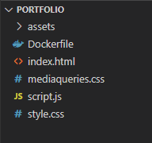
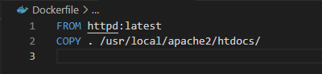
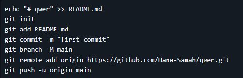
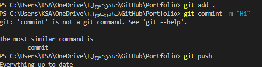
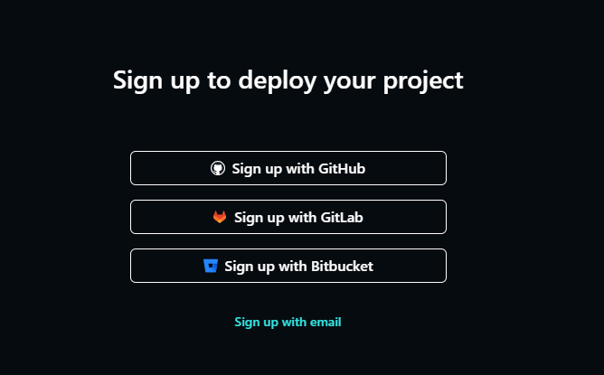
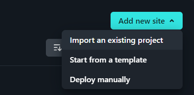
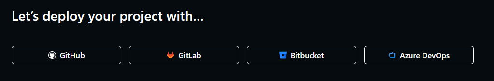
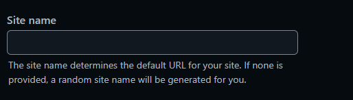
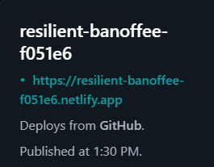

# Portfolio – 2024 Project

## Overview
This project consists of a simple website developed using HTML, CSS, and JavaScript, showcasing information about me and some of my projects. The website is containerized using Docker to ensure consistent deployment across different environments.

### Tools Used:
- **Docker Desktop**: For managing containerization.
- **Visual Studio Code**: As the primary code editor.
- **Git & GitHub**: For version control and collaboration.
- **Netlify**: For hosting and sharing the project.

---

## Project Details

### Creating a Docker Image and Running a Container
A Docker image was created using a `Dockerfile` that specifies the required environment and dependencies for the project. This ensures that the project can run consistently regardless of the host machine's configuration.

#### Steps to Create and Run the Docker Container:
1. Write the code for the project (HTML, CSS, JS).
2. Create a `Dockerfile` inside the project directory.

   

3. Specify the necessary instructions in the `Dockerfile`.

   

4. Build the Docker image using the terminal.

   
   

5. Run the image to start a Docker container.

6. Access the project locally by navigating to `localhost:2000` in a web browser.

   

---

## Git and GitHub Integration
After completing the code, the project is pushed to GitHub for version control, collaboration, and tracking changes.

#### Steps to Upload Code to GitHub:
1. Create a new GitHub repository.

   

2. Open the terminal in the project directory.
3. Initialize Git, add the project files, and push the code to the repository.

   

---

## Deploying with Netlify
Netlify was used to host and share the project publicly. The platform automates the deployment process from GitHub, making it easy to deploy updates.

#### Steps to Deploy Using Netlify:
1. Register on Netlify using GitHub.

   

2. Add a new site.

   

3. Select the GitHub repository containing the project.

   

4. Set the site name and click deploy.

   

5. Share the generated link to make the project accessible to others.

   
   https://resilient-banoffee-f051e6.netlify.app

---

This project demonstrates the use of modern DevOps tools like Docker and GitHub, alongside web technologies, to create, containerize, and deploy a personal portfolio site.
